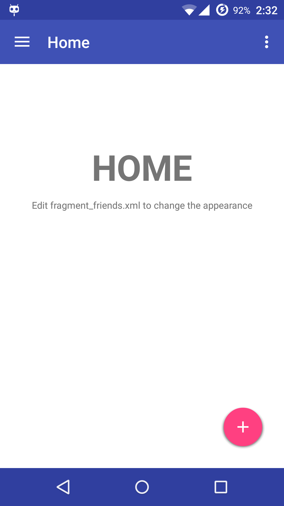

# MaterialDesignAppSample
========================
A sample Android application that implements Google's Material Design design principles, such as the slide-out navigation drawer and FAB.

# Getting Started
========================
To start developing in Android Studio, group all of the files EXCEPT for "LICENSE", "README", and "SCREENSHOT" into one folder. Then simply "Import Project" in Android Studio by navigating and selecting the folder you should have created.

# Screenshots
========================
 
 

#Credits
========================
* Inspired by Ravi Tamada's article at [AndroidHive](http://www.androidhive.info/2015/04/android-getting-started-with-material-design/)
* Inspired by [Antonio Leiva](http://antonioleiva.com/material-design-everywhere/) on using AppCompat21

#Copyright
========================
Copyright 2015 Chin Bo Wen. All rights reserved. 

Licensed under the Apache License, Version 2.0 (the "License");
you may not use this file except in compliance with the License.
You may obtain a copy of the License at

   http://www.apache.org/licenses/LICENSE-2.0

Unless required by applicable law or agreed to in writing, software
distributed under the License is distributed on an "AS IS" BASIS,
WITHOUT WARRANTIES OR CONDITIONS OF ANY KIND, either express or implied.
See the License for the specific language governing permissions and
limitations under the License.
